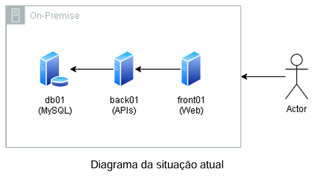
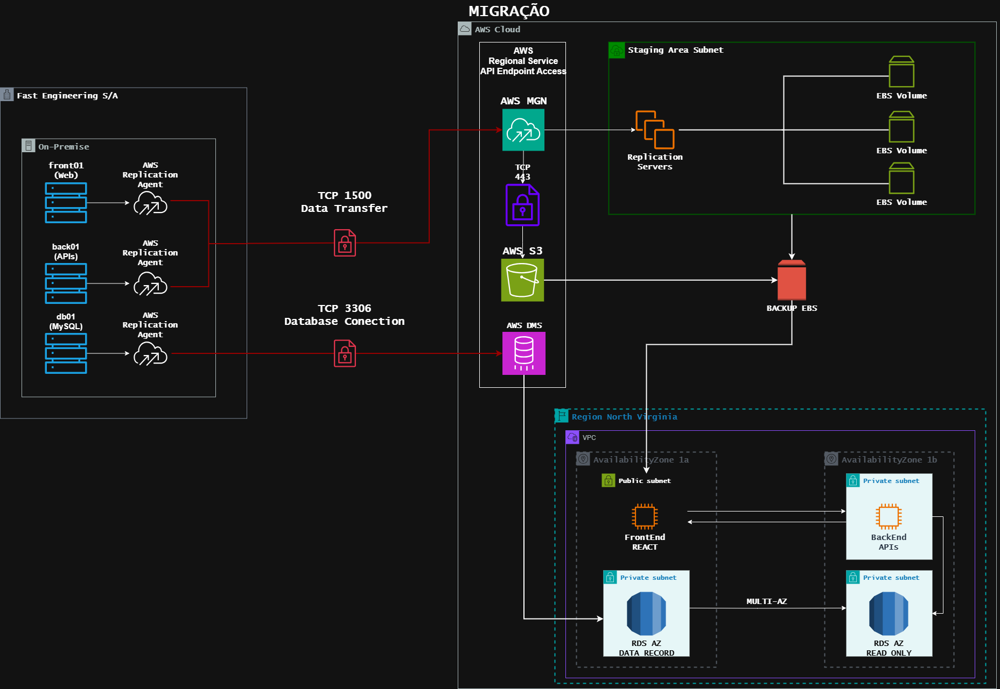
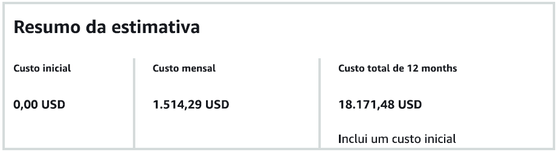
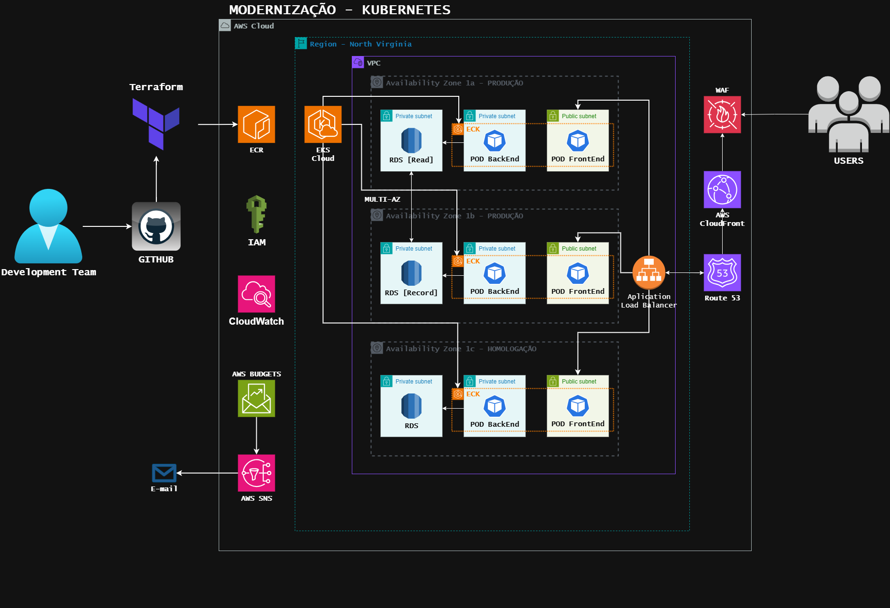
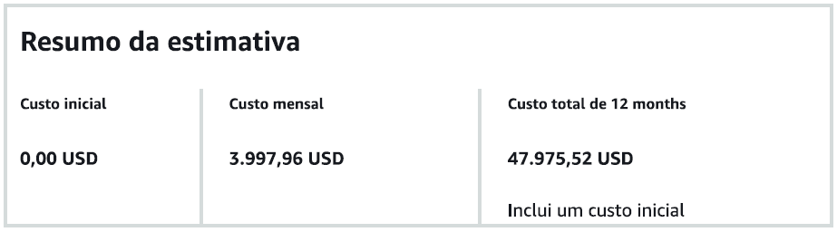

# Projeto Final AWS

Olá, seja bem-vindo! Este projeto aborda um caso de migração e modernização de arquitetura de um e-commerce fictício para o ambiente de serviços da AWS Cloud. A seguir vamos entender os recuros e ferramentas utilizadas, além de estimativas de custo através da própria plataforma da AWS: **AWS Pricing Calculator**.

## Contexto

Devido a crescente demanda de acessos e compras que o e-commerce fictício "Fast Engineering S/A" anda recebendo, sua solução atual de infraestrutura e arquitetura não está mais suportando a atual carga de trabalho.

Abaixo é possível visualizar os recursos da infraestrutura atual:

- 01 servidor para Banco de Dados Mysql (500GB de dados, 10Gb de RAM, 3 Core CPU);
- 01 servidor para a aplicação utilizando REACT – frontend (5GB de dados, 2Gb de RAM, 1 Core CPU);
- 01 servidor de backend com 3 APIs, com o Nginx servindo de balanceador de carga e que armazena estáticos como fotos e links. (5GB de dados, 4Gb de RAM, 2 Core CPU).

A empresa responsável pelo e-commerce deseja modernizar esse sistema para a **AWS Cloud** com nova estrutura em Kubernetes, para isso sendo preciso seguir as melhores práticas de arquitetura em Cloud AWS. A nova arquitetura deve seguir as diretrizes abaixo:
- Ambiente Kubernetes;
- Banco de dados gerenciado (PaaS e Multi AZ);
- Backup de dados;
- Sistema para persistência de objetos (imagens, vídeos etc.);
- Segurança.

Além disso, a empresa de e-commerce informou que é necessário realizar essa migração para a AWS Cloud o mais rápido possível antes que a modernização seja propriamente realizada. Para isso, vamos fazer uma migração "lift-and-shift" (também conhecida como migração "as-is").

A migração do tipo "lift-and-shift" é uma abordagem de migração na qual uma aplicação ou sistema é transferido de um ambiente (geralmente local, como um data center) para outro (como a nuvem - AWS Cloud), sem fazer alterações significativas em seu design, arquitetura ou funcionalidades. Por isso que, para fins **apenas** de migração, essa abordagem foi escolhida.

Portanto, para seguirmos com os procedimentos de migração e modernização, vamos segmentá-los em duas etapas (etapa 1 e etapa 2) e desenvolver cada sub-etapa que seguirá adiante.

## Etapa 1: Migração "As-Is"
* Quais atividades são necessárias para a migração?
A princípio é necessário identificar as tecnologias atuais do e-commerce e planejar sua migração através de um diagrama. As tecnologias atuais estão sendo mencionadas acima, então podemos seguir para a etapa de diagrama.

No diagrama iremos planejar, por um lado, como serão feitas as conexões com o ambiente AWS; por outro lado, iremos planejar como o ambiente AWS estará configurado para receber essa arquitetura que será migrada.

* Quais ferramentas vão ser utilizadas?
    - Para a construção do diagrama vamos utilizar a ferramenta open-source **Draw.io**. Encontra-se disponível através do link: https://github.com/jgraph/drawio-desktop/releases/tag/v26.0.4
    - Finalizado o planejamento, pode-se desenvolver as etapas iniciais da migração instalando o "AWS Replication Agent": Um agente instalado no servidor de origem (on-premisses) que ajuda a capturar mudanças de dados em tempo real. Trabalha junto com o **AWS DMS** e **AWS MGN** para replicar dados continuamente. Para esse recurso em específico é necessário entrar em contato com a equipe de vendas e equipe técnica da AWS para obter as orientações corretas;
    - Estimar custos através da **AWS Pricing Calculator**.

* Qual o diagrama da infraestrutura na AWS?

* Como serão garantidos os requisitos de Segurança?
    - **AWS Regional Service API Endpoint Access**:
    - **VPC**: a VPC cria um ambiente de rede isolado onde apenas os nossos serviços podem se comunicar, não podendo ser acessada diretamente sem configuração explícita;
    - **Subnets Privadas**: são usadas para hospedar os recursos sensíveis (bancos de dados e servidores de backend), garantindo maior segurança;
* Como será realizado o processo de Backup?
    - **Backup EBS**: usado como backup por meio de snapshots, que criam cópias seguras dos dados armazenados nos volumes EBS;
    - **RDS Multi-AZ**: RDS cria uma instância primária (onde as operações normais de leitura e escrita ocorrem) e uma instância secundária (replicada automaticamente e em standby);
* Qual o custo da infraestrutura na AWS (AWS Calculator)?

Para conferir as informações mais detalhadas, favor acessar a [estimativa de migração](migration_estimate.pdf).

## Etapa 2: Modernização/Kubernetes
* Quais atividades são necessárias para a modernização?
    - Planejamento da arquitetura de modernização através do **Draw.io**;
    - Calcular custos estimados através da **AWS Pricing Calculator**.

* Quais ferramentas vão ser utilizadas?
    - Para fins de planejamento, usaremos o **Draw.io** novamente (link de download acima);
    - **Github**: repositório GitHub contém os arquivos `.tf` que definem os recursos da AWS (RDS, EC2, S3, etc.);
    - **Terraform**: O Terraform lê os arquivos `.tf`, gerando um plano de execução e aplicando as mudanças na AWS Cloud.

* Qual o diagrama da infraestrutura na AWS?

* Como serão garantidos os requisitos de Segurança?
    - **VPC**:servidores não ficam expostos na internet sem necessidade;
    - **Subnets Privadas**: subnet sem IP público, reduz riscos de ataques externos; apenas serviços internos podem se comunicar com os servidores, com comunicação dentro da VPC rápida e segura;
    - **IAM**: evita uso de credenciais fixas; dá acesso apenas ao necessário (princípio do menor privilégio);
    - **WAF**: com configuração flexível e baseada em regras, o **AWS Web Application Firewall** possui maior segurança para APIs e sites com integração com AWS Shield para proteção DDoS e monitoramento e análise de tráfego malicioso;

* Como será realizado o processo de Backup?
    - **RDS Multi-AZ**: possui backups sem impacto, visto que os backups automáticos ocorrem em instância secundária, reduzindo o impacto no desempenho do banco de dados primário (zona de disponibilidade diferente).
* Qual o custo da infraestrutura na AWS (AWS Calculator)?

Para conferir as informações mais detalhadas, favor acessar a [estimativa de modernização](modernization_estimate.pdf).

## Conclusão

Apesar de se tratar de projeto de caso fictício, foi possível entender com mais profundidade os recursos e serviços da AWS Cloud, entender melhor a integração e comunicação entre esses serviços, e poder utilizar das boas práticas do mercado para planejar a migração e modernização de um ambiente com infraestrutura fictícia.
